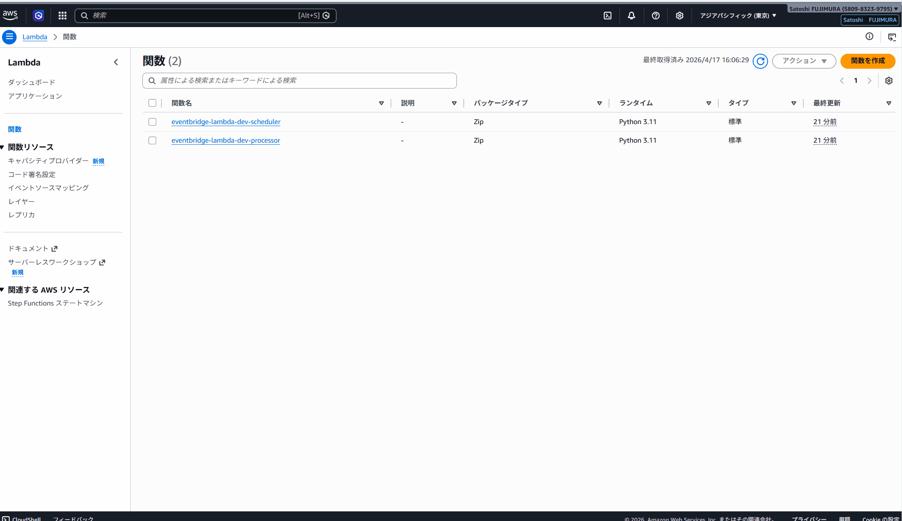

# aws-eventbridge-lambda


Amazon EventBridge + AWS Lambda による**スケジュール実行**と**S3 イベント駆動**の 2 パターンを Terraform で IaC 化した PoC。

---

## デモ



---

## アーキテクチャ

### Pattern A: スケジュール実行（定期レポート生成）

```
EventBridge Scheduler
（毎日 9:00 JST / cron）
        ↓
  AWS Lambda
（日次レポート生成）
        ↓
  Amazon S3
（reports/YYYY-MM-DD/daily-report.json）
```

### Pattern B: S3 イベント駆動（ファイル処理自動化）

```
ファイルアップロード
        ↓
  Amazon S3（input バケット）
        ↓ EventBridge通知（Object Created）
  Amazon EventBridge
        ↓
  AWS Lambda
（ファイル情報を処理）
        ↓
  Amazon DynamoDB
（処理結果を記録）
```

---

## 技術スタック

| カテゴリ | 技術 |
|---|---|
| イベント管理 | Amazon EventBridge（スケジュール / イベントパターン） |
| 処理 | AWS Lambda（Python 3.11） |
| ストレージ | Amazon S3（レポート保存 / イベントトリガー） |
| DB | Amazon DynamoDB（処理結果記録 / PAY_PER_REQUEST） |
| IaC | Terraform（モジュール構成） |
| 監視 | Amazon CloudWatch Logs（7日保持） |

---

## ディレクトリ構成

```
aws-eventbridge-lambda/
├── lambda_src/
│   ├── scheduler/          # Pattern A: 定期レポート生成 Lambda
│   │   └── index.py
│   └── processor/          # Pattern B: S3 イベント処理 Lambda
│       └── index.py
├── modules/
│   ├── lambda/             # Lambda 関数 + IAM ロール（共通モジュール）
│   ├── eventbridge/        # EventBridge ルール + Lambda 実行権限
│   └── s3/                 # S3 バケット + EventBridge 通知設定
├── environments/
│   └── dev/
│       ├── main.tf         # モジュール統合 + DynamoDB
│       ├── variables.tf
│       ├── outputs.tf
│       └── terraform.tfvars.example
└── docs/
```

---

## 動作確認スクリーンショット

| # | 内容 |
|---|---|
| 1 | Lambda 関数一覧（scheduler・processor の 2 関数） |
| 2 | EventBridge Scheduler 詳細（cron 設定画面） |
| 3 | EventBridge Rules 詳細（S3 イベントパターン画面） |
| 4 | S3 report バケット内 `reports/YYYY-MM-DD/daily-report.json`（Pattern A 確認） |
| 5 | S3 input バケット（Pattern B アップロード後） |
| 6 | CloudWatch Logs（Lambda 実行ログ） |
| 7 | DynamoDB テーブル 項目探索（Pattern B 処理結果） |

スクリーンショットは [`docs/`](./docs/) フォルダに格納。

---

## デプロイ手順

### 1. Terraform apply

```bash
cd environments/dev
cp terraform.tfvars.example terraform.tfvars
terraform init
terraform plan
terraform apply
```

### 2. Pattern A 動作確認（手動テスト）

```bash
# Lambda を手動で即時実行
aws lambda invoke \
  --function-name eventbridge-lambda-dev-scheduler \
  --payload '{}' \
  response.json

# S3 にレポートが保存されたか確認
aws s3 ls s3://$(terraform output -raw report_bucket_name)/reports/ --recursive
```

### 3. Pattern B 動作確認（ファイルアップロード）

```bash
# input バケットにファイルをアップロード → Lambda が自動起動
echo "test data" > test.txt
aws s3 cp test.txt s3://$(terraform output -raw input_bucket_name)/

# DynamoDB に記録されたか確認
aws dynamodb scan --table-name $(terraform output -raw dynamodb_table_name)
```

### 4. リソース削除

```bash
terraform destroy
```

---

## IAM 設計（最小権限）

| 関数 | 権限 | 対象リソース |
|---|---|---|
| scheduler | `s3:PutObject` | report バケットのみ |
| processor | `dynamodb:PutItem` | 処理結果テーブルのみ |
| 共通 | CloudWatch Logs 書き込み | 自関数のロググループのみ |

---

## 技術的なポイント・工夫

- **2 パターンの EventBridge 活用**: `schedule_expression`（cron）と `event_pattern`（S3 Object Created）を 1 リポジトリで実装・比較できる
- **S3 → EventBridge 通知**: `aws_s3_bucket_notification` で `eventbridge = true` を設定するだけで S3 イベントが EventBridge に流れる（SNS / SQS 不要）
- **Lambda モジュールの共通化**: 2 つの Lambda 関数を同一モジュールで管理。`policy_statements` 変数で関数ごとの IAM ポリシーを注入する設計
- **最小権限 IAM**: 各 Lambda は必要最小限のリソース ARN のみに権限を付与
- **DynamoDB PAY_PER_REQUEST**: 検証環境のため従量課金。本番では Provisioned に変更してコストを安定化する

---

## コスト目安（検証時）

| リソース | 概算 |
|---|---|
| Lambda（月 30 回スケジュール実行） | ほぼ無料枠内 |
| EventBridge（カスタムイベント） | 100 万件まで $1 |
| S3（少量のレポートファイル） | ほぼ無料枠内 |
| DynamoDB（PAY_PER_REQUEST / 少量） | ほぼ無料枠内 |

> 検証後は `terraform destroy` でリソース削除を推奨。

---

## CI / セキュリティスキャン

GitHub Actions で Terraform の静的解析（Checkov）を自動実行しています。

### 実施内容

| ジョブ | 内容 |
|---|---|
| terraform fmt | フォーマット違反の検出 |
| terraform validate | 構文・参照エラーの検出 |
| Checkov セキュリティスキャン | IaC のセキュリティポリシー違反を検出（soft_fail: false） |

### セキュリティ対応（Terraform で修正した内容）

| リソース | 追加設定 |
|---|---|
| S3（report / input バケット） | SSE-AES256 暗号化・パブリックアクセスブロック（4項目）・バージョニング・ライフサイクル（90日削除 + multipart abort 7日） |
| DynamoDB | PITR（Point-in-Time Recovery）・`deletion_protection_enabled = true` |
| Lambda | `tracing_config { mode = "PassThrough" }`（X-Ray 有効化） |
| CloudWatch Logs | 保持期間を変数化（デフォルト 30 日） |

### 意図的にスキップしている項目（dev 環境の合理的な省略）

| チェック ID | 内容 | 理由 |
|---|---|---|
| CKV_AWS_117 | Lambda VPC 内配置 | dev 環境では不要（シンプル構成優先） |
| CKV_AWS_272 | Lambda コード署名 | dev 環境では不要 |
| CKV_AWS_116 | Lambda DLQ 設定 | dev 環境では不要 |
| CKV_AWS_115 | Lambda 予約済み同時実行 | dev 環境では不要 |
| CKV_AWS_28 / CKV_AWS_119 | DynamoDB KMS CMK | AWS 管理キーで十分 |
| CKV_AWS_145 | S3 KMS 暗号化 | AES256 で十分 |
| CKV_AWS_173 | Lambda 環境変数 KMS | dev 環境では不要 |
| CKV_AWS_158 | CloudWatch Logs KMS | dev 環境では不要 |
| CKV_AWS_338 | CloudWatch Logs 保持期間 1 年未満 | dev は 30 日で十分 |
| CKV_AWS_18 | S3 アクセスログ | dev 環境では不要 |
| CKV_AWS_144 | S3 クロスリージョンレプリケーション | dev 環境では不要 |
| CKV2_AWS_62 | S3 通知設定 | report バケットは通知不要 |

---

## AI 活用について

本プロジェクトは以下の Anthropic ツールを活用して開発しています。

| ツール | 用途 |
|---|---|
| **Claude Code** | インフラ設計・コード生成・デバッグ・コードレビュー。コミットまで一貫してサポート |
| **Claude Cowork** | 技術調査・設計相談・ドキュメント作成を日常的に活用。AI との協働を業務フローに組み込んでいる |
| **カスタム Skills** | Terraform / Python / AWS に特化した Skills を設定・継続的に更新。自分の技術スタックに最適化したワークフローを構築 |

> AI を「使う」だけでなく、自分の業務・技術スタックに合わせて**設定・運用・改善し続ける**ことを意識しています。

---

## 学習で気づいたこと・躓いたポイント

### EventBridge

- **Scheduler と Rules の使い分け**: スケジュール実行は `EventBridge Scheduler`（`aws_scheduler_schedule`）、イベントパターンマッチは `EventBridge Rules`（`aws_cloudwatch_event_rule`）と別サービス。タイムゾーン設定の場所や Terraform リソース名が違うので混同しやすい。
- **cron 式は UTC 基準**: EventBridge のスケジュールは UTC で指定する。JST（UTC+9）の 9:00 に実行したい場合は `cron(0 0 * * ? *)` と書く（9-9=0）。

### S3 → EventBridge 通知

- **`eventbridge = true` の設定が必要**: `aws_s3_bucket_notification` で `eventbridge = true` を指定するだけで S3 イベントが EventBridge に流れる。SNS/SQS を使う旧来の方法と混同しがちなので注意。一方で、この設定をしないとバケット操作がイベントとして発火しない。

### Lambda

- **Lambda モジュールの共通化で嵌った点**: 2 つの Lambda 関数を同一モジュールで管理する際、`policy_statements` 変数でポリシーを外部から注入する設計にしたが、変数の型定義（`list(object({...}))`）が厳密なため型の過不足でエラーが出た。最初から型を決めてから設計すると楽。

---

## 関連リポジトリ

- [terraform-aws-operations](https://github.com/satoshif1977/terraform-aws-operations) - CloudWatch 監視・SNS 通知・Runbook（Lambda 監視アラームも含む）
- [aws-step-functions-bedrock](https://github.com/satoshif1977/aws-step-functions-bedrock) - Step Functions + Bedrock による AI ワークフロー
- [aws-ecs-bedrock-chat](https://github.com/satoshif1977/aws-ecs-bedrock-chat) - ECS Fargate + Bedrock チャットアプリ
